<p align="center">
  
</p>

<h1 align="center">BioManager</h1>

<p align="center">
  <b>Your lab's animals, stocks and supplies — in one place, instead of twenty spreadsheets.</b><br>
  Mice · zebrafish · flies · worms · plasmids · samples · orders · reagents · antibodies · calendar · notebook
</p>

<p align="center">
  
  
  
  
  
  <a href="LICENSE"></a>
</p>

<p align="center">
  <a href="#-what-you-can-track">What it tracks</a> ·
  <a href="#-features-across-the-app">Features</a> ·
  <a href="#-ways-to-run-it">Ways to run it</a> ·
  <a href="#-getting-started">Get started</a> ·
  <a href="#-a-first-week-with-biomanager">First week</a> ·
  <a href="#-documentation">Docs</a>
</p>

<p align="center">
  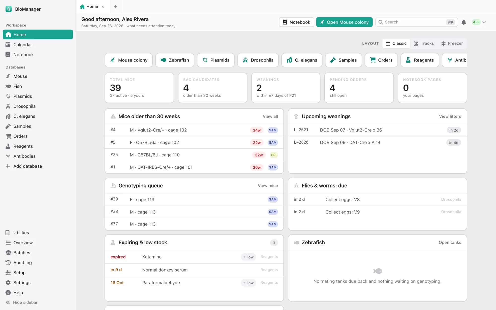
  <br><sub><i>Home — every morning, what needs doing today.</i></sub>
</p>

---

BioManager replaces the pile of spreadsheets, whiteboards and paper cage
cards most labs run on. You edit records **the way you would in a
spreadsheet**, but underneath is a real database. It knows which mouse is
in which cage, when a litter needs weaning, which fly vials need flipping
and which antibody is about to expire — and it tells you.

It runs as a **desktop app** for one person, or on a **lab server** that
everyone signs in to from a browser, including on their phone at the rack.

<table>
  <tr>
    <td width="33%" valign="top">
      <h3>🧑‍🔬 Lab members</h3>
      Manage your own lines, fish, stocks and samples without hunting
      through someone else's spreadsheet.
    </td>
    <td width="33%" valign="top">
      <h3>📋 Lab managers &amp; PIs</h3>
      A census that is actually complete: who owns what, which cages are
      idle, what is overdue.
    </td>
    <td width="33%" valign="top">
      <h3>🧬 Multi-organism labs</h3>
      Mice, fish, flies and worms side by side — plus a database for any
      other organism, set up in a few clicks.
    </td>
  </tr>
</table>

---

## 🔬 What you can track

| | Module | In one line |
|:-:|---|---|
| 🐭 | [**Mouse colony**](#-mouse-colony) | Mice, cages, litters, breeders, strains, experiments and racks |
| 🐟 | [**Zebrafish**](#-zebrafish) | Lines, tanks, fish, clutches, matings and water systems |
| 🪰 | [**Drosophila & C. elegans**](#-drosophila-and-c-elegans) | Vials and plates, crosses, and temperature-aware flip schedules |
| 🦎 | [**Any other organism**](#-any-other-organism) | Your own database, in your own words, with no programming |
| 🧬 | [**Plasmids**](#-plasmids) | Sequences with an interactive map, and where each tube lives |
| 🧪 | [**Lab inventories**](#-lab-inventories) | Samples, orders, reagents, antibodies, or a list of your own |
| 📅 | [**Calendar & notebook**](#-calendar-and-notebook) | Experiments, to-dos, colony dates and notes, all linked |

### 🐭 Mouse colony

The most complete module, built around how a mouse room actually works.

<p align="center">
  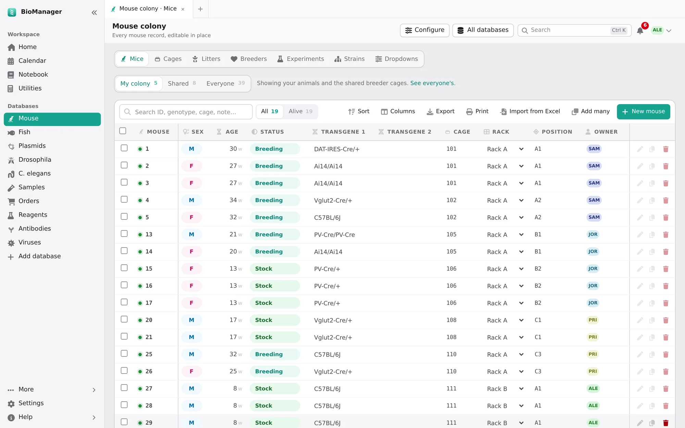
</p>

- **Mice** — a spreadsheet of every animal: ID, sex, age, status,
  transgenes, cage, rack, owner and notes. IDs are assigned in order and
  never reused. A mouse is alive until it has a date of death, and the
  green dot shows which is which.
- **Cages** — every cage with its rack position, purpose, owner, the mice
  inside (with the sex breakdown), litter born and the P21 weaning date.
  Expand a cage to edit its mice right there.
- **Litters** — record a birth once, and the weaning date (P21) and
  genotyping date (about P28) follow from it.
- **Breeders** — breeding cages at a glance, with breeders past 30 weeks
  flagged.
- **Strains** and **Experiments** — your lab's lines with owners, and
  groups of mice under one experiment with a shared treatment group.

<table>
  <tr>
    <td width="50%">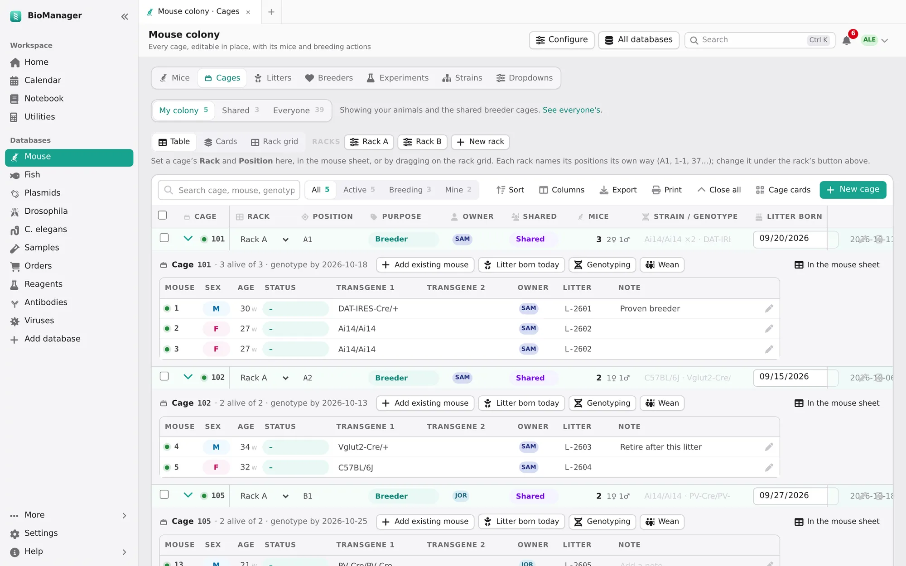</td>
    <td width="50%">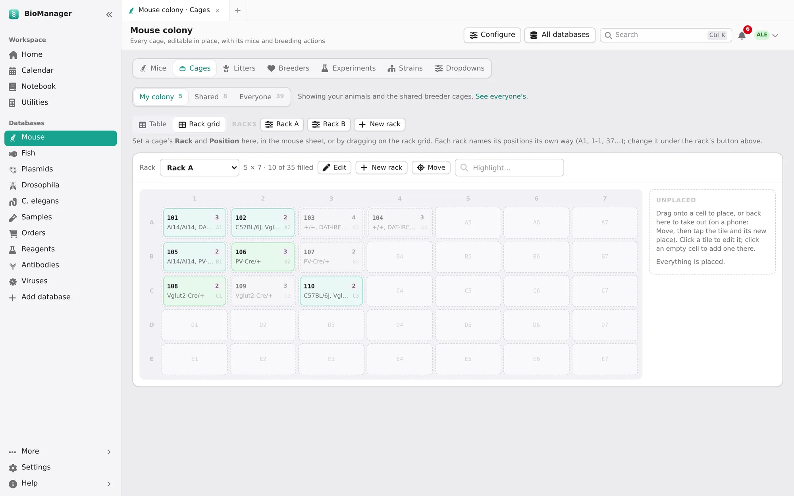</td>
  </tr>
  <tr>
    <td align="center"><sub><b>Cages</b> — one row per cage, mice one click away</sub></td>
    <td align="center"><sub><b>Rack grid</b> — drag a cage to move it</sub></td>
  </tr>
</table>

### 🐟 Zebrafish

Lines, tanks, individual fish, clutches, matings (and returning the fish
afterwards), water systems with water-quality logs, and a sac log. A tank
can hold a group with a headcount, or resolve into named individuals.

### 🪰 Drosophila and C. elegans

Vial (fly) and plate (worm) databases, organised into racks inside
incubators.

- Label each vial with its genotype and purpose: stock, experiment,
  cross or progeny.
- **Set crosses**, collect eggs or pick progeny into new vials, and see
  when the progeny will be adults.
- **Flip / chunk schedules that follow temperature** — flip every 14 days
  at 25 °C, every 28 at 18 °C — and they show up on Home when due.
- Frozen-stock records for worms.

<table>
  <tr>
    <td width="50%">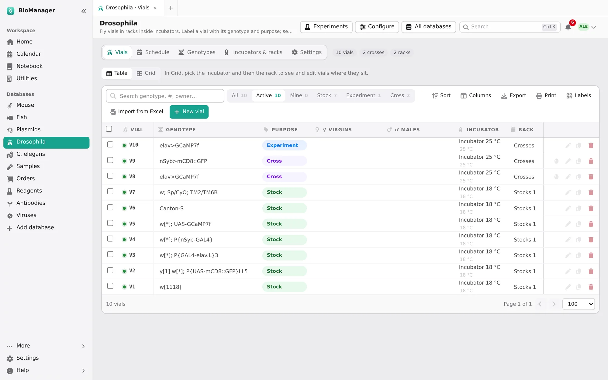</td>
    <td width="50%">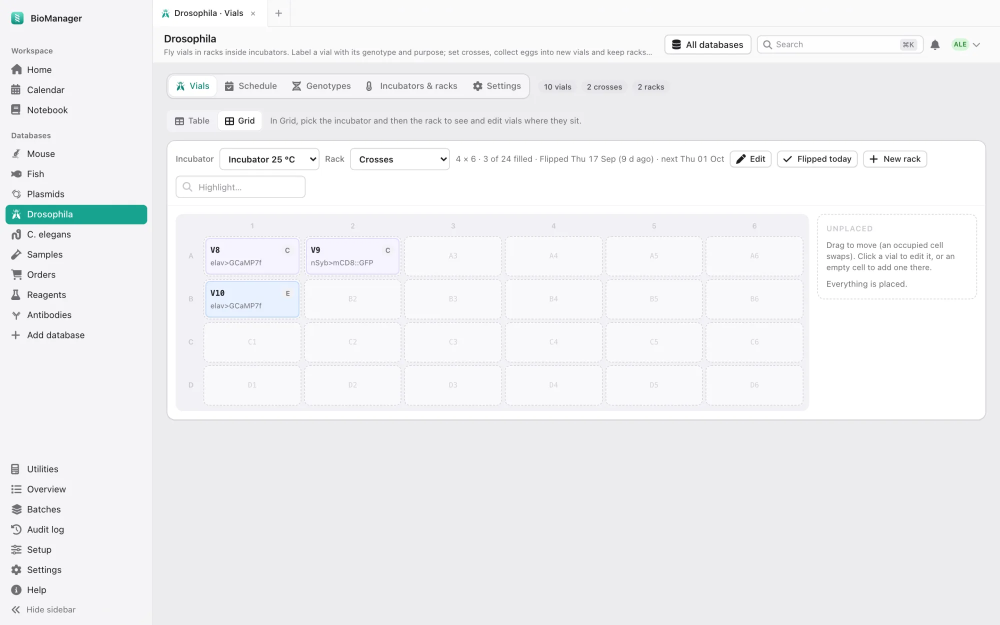</td>
  </tr>
  <tr>
    <td align="center"><sub><b>Vials</b> — genotype, purpose, incubator, rack</sub></td>
    <td align="center"><sub><b>Grid</b> — the rack as it sits in the incubator</sub></td>
  </tr>
</table>

### 🦎 Any other organism

Choose **Add database** in the sidebar, start from a preset or a blank
sheet, and describe your organism:

- **The words it uses** — cage, tank, vial or plate; strain, line or
  stock; litter, clutch or progeny. The interface then speaks your
  language.
- **How it is counted** — individual animals, groups with a headcount,
  or both.
- **What it needs**, from a checklist — crosses, cohorts, a nursery
  stage, genotyping, environment logs, cryo inventory, census and more.
- **Schedules** like "wean at P21", which can vary with rearing
  temperature.
- **Your own columns** — text, numbers, dates, dropdowns, people or links.

<p align="center">
  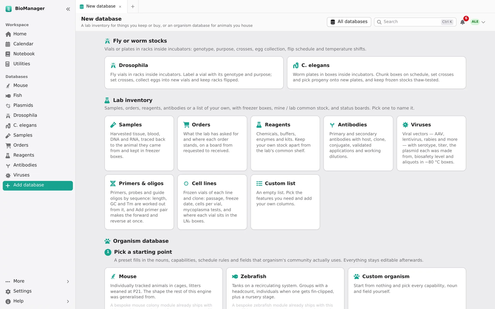
</p>

> [!TIP]
> Xenopus, axolotls, cell lines, yeast strains — anything you keep in
> containers and breed or passage fits here. No code and no migration.

### 🧬 Plasmids

Upload a GenBank, FASTA or SnapGene file and BioManager keeps the sequence
and its features, with an interactive map you can edit. Plasmid boxes sit
on the same rack grid as everything else, so every tube has an address.

<p align="center">
  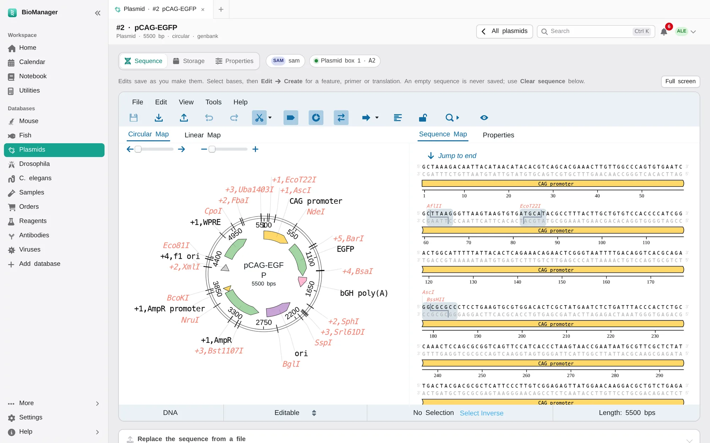
</p>

### 🧪 Lab inventories

Every inventory runs on the same engine, starting from a preset you can
change:

| Preset | Tracks |
| --- | --- |
| 🧫 **Samples** | harvested tissue and material, linked to the animal it came from, stored at RT / 4 °C / −20 °C / −80 °C / LN₂ in a box position |
| 🛒 **Orders** | a board from *requested* to *ordered* to *received*, with vendor, catalogue number, price and grant account |
| ⚗️ **Reagents** | quantity, concentration, CAS number, hazard, supplier and lot, and expiry dates with warnings |
| 🔬 **Antibodies** | host, clonality, clone, conjugate, reactivity, applications, dilution, RRID and where each vial is stored |
| 📝 **Custom** | whatever you define |

Each inventory can keep **your own stock** apart from **lab common
stock**, and statuses and categories can be renamed without losing items.

- **Filter orders by status** — one tap shows only what is requested,
  ordered, received or cancelled.
- **Nothing half-filled** — an order can't be placed without its item,
  vendor, catalogue number and quantity. Configure chooses what any
  inventory requires.
- **Type it once** — every column suggests what the lab has typed before;
  pick an earlier item or catalogue number and the vendor, price and grant
  fill themselves in.
- **Order again** — one click on a reagent or antibody starts a new order
  with its details, and the quantity, price and grant of the last time.
- **From the box to the shelf** — when an order is marked received,
  BioManager offers to add it to Reagents or Antibodies with everything
  already filled in.

<table>
  <tr>
    <td width="50%">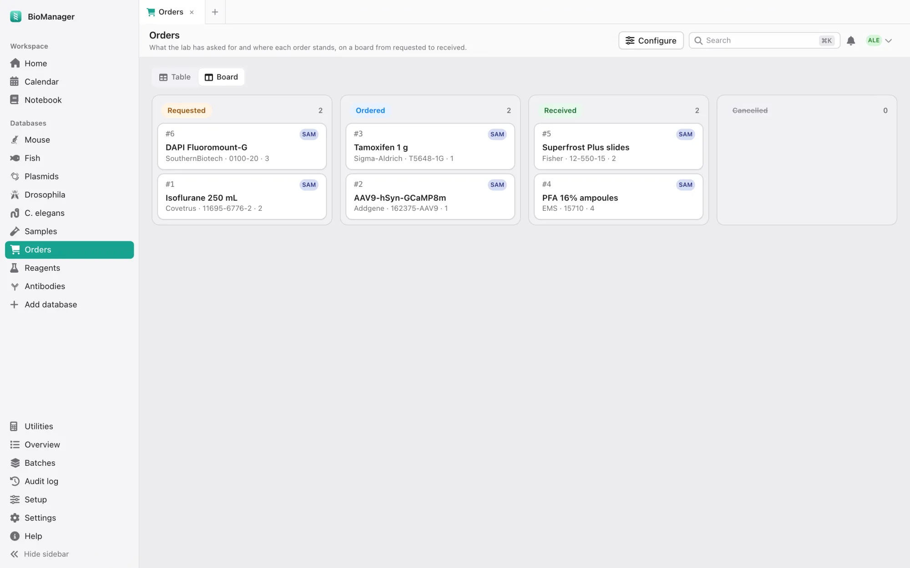</td>
    <td width="50%">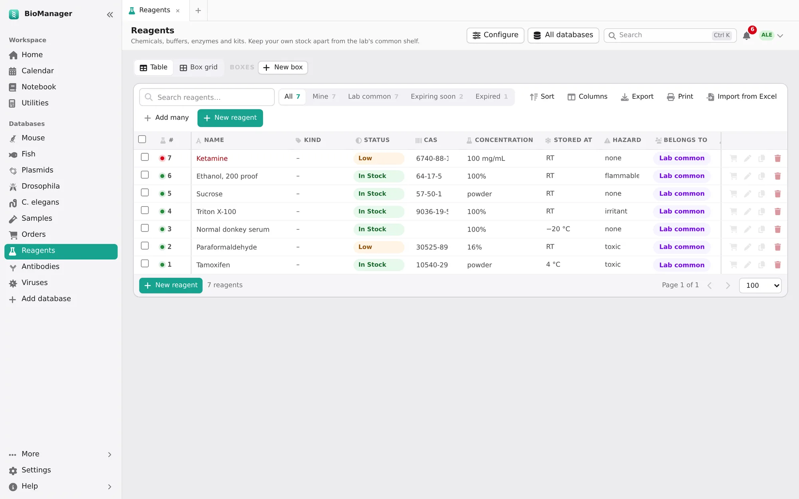</td>
  </tr>
  <tr>
    <td align="center"><sub><b>Orders</b> — drag a card when it arrives</sub></td>
    <td align="center"><sub><b>Reagents</b> — what's low, what's expiring</sub></td>
  </tr>
</table>

### 📅 Calendar and notebook

- **Calendar** — experiments and to-dos, with colony dates (weanings,
  genotyping, sac reminders) filled in for you. Shows your **Google
  Calendar** and any **ICS subscription** alongside.
- **Lab notebook** — pages in tabs, reusable templates, images and file
  attachments. A page links to animals and calendar events, so the record
  and the notes point at each other.
- **Utilities** — molecular-weight reference data and a
  concentration-to-mass calculator.

<p align="center">
  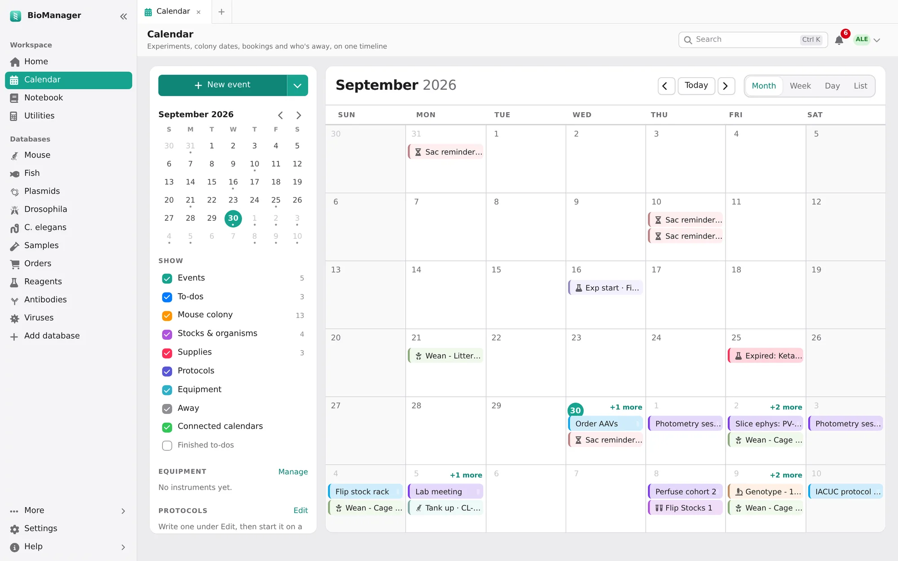
</p>

---

## ✨ Features across the app

<table>
  <tr>
    <td width="50%" valign="top">
      <h4>☀️ A home page that tells you what to do</h4>
      Mice older than 30 weeks, upcoming weanings, the genotyping queue,
      vials due for flipping, expiring stock, zebrafish tasks, the next
      14 days and recent orders.
    </td>
    <td width="50%" valign="top">
      <h4>📊 Spreadsheet-style editing</h4>
      Click a cell and type; it saves as you go. Every table sorts,
      filters, exports to CSV and prints.
    </td>
  </tr>
  <tr>
    <td valign="top">
      <h4>➕ Add many at once</h4>
      Describe one mouse and say how many (<code>4 females, 2 males</code>),
      or upload a CSV. You check an editable preview — IDs included —
      before anything is saved.
    </td>
    <td valign="top">
      <h4>↩️ Batch actions with undo</h4>
      Tick rows, then set a field, add them to an experiment or sac them.
      Every bulk action can be <b>undone</b> — unless someone has edited
      those records since, so their work is never silently lost.
    </td>
  </tr>
  <tr>
    <td valign="top">
      <h4>🗄️ Racks named your way</h4>
      <code>D7</code>, <code>4-7</code>, <code>7D</code>, <code>G12</code>
      or plain 1 to 80. Each rack keeps its own scheme, and a grid shows
      what is where.
    </td>
    <td valign="top">
      <h4>🔎 Search and tabs</h4>
      <kbd>⌘</kbd>/<kbd>Ctrl</kbd> + <kbd>K</kbd> searches everything.
      Every page opens as a tab you can reorder, and your tabs are still
      there tomorrow.
    </td>
  </tr>
  <tr>
    <td valign="top">
      <h4>🕓 Full change history</h4>
      Every create, edit and delete is recorded with who and exactly what
      changed (<code>genotype: DBH-Cre → ∅</code>).
    </td>
    <td valign="top">
      <h4>🔐 Sign-in options and reminders</h4>
      Sign in with Google, Microsoft or a password. Optional daily emails
      list what is overdue or coming up for each person.
    </td>
  </tr>
</table>

### 📱 Cage cards that open on your phone

Print correctly sized cards for cages, tanks and vials. Scan the QR code
with any phone camera at the rack and that cage opens, ready to edit —
nobody walks back to a computer to type an ID.

<table>
  <tr>
    <td width="62%" valign="top">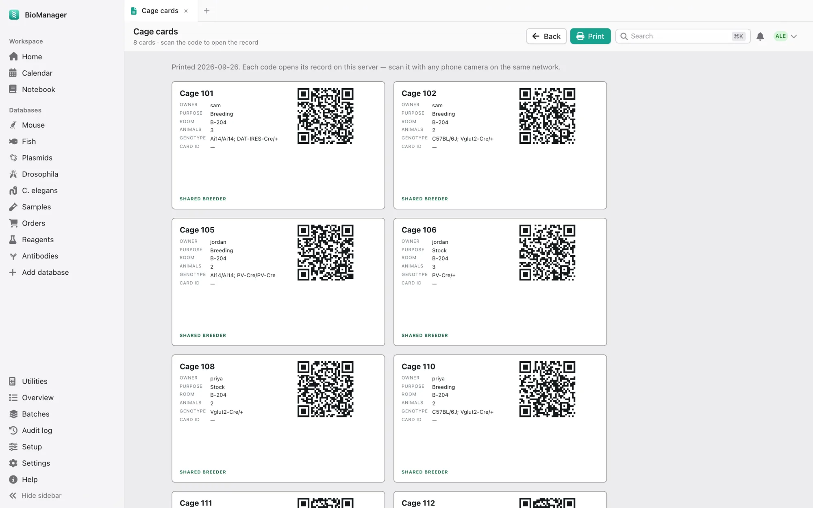</td>
    <td width="19%" valign="top">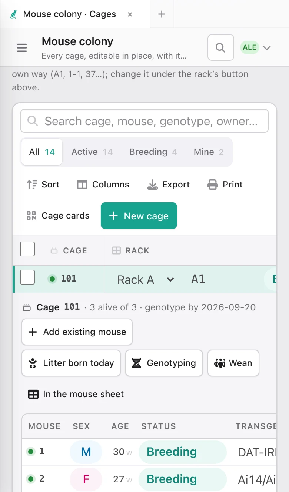</td>
    <td width="19%" valign="top">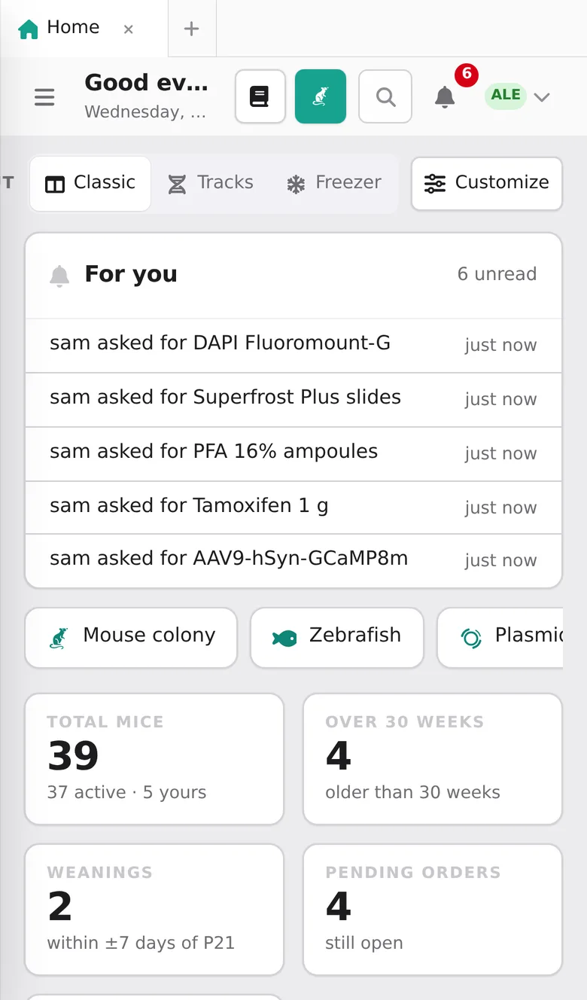</td>
  </tr>
  <tr>
    <td align="center"><sub><b>Print</b> the cards</sub></td>
    <td align="center"><sub><b>Scan</b> one…</sub></td>
    <td align="center"><sub>…or check <b>Home</b></sub></td>
  </tr>
</table>

### 🌗 At home on a Mac, and in the dark

The interface follows macOS conventions and has a full dark mode. It works
in any modern browser on Windows and Linux too.

<table>
  <tr>
    <td width="50%"></td>
    <td width="50%">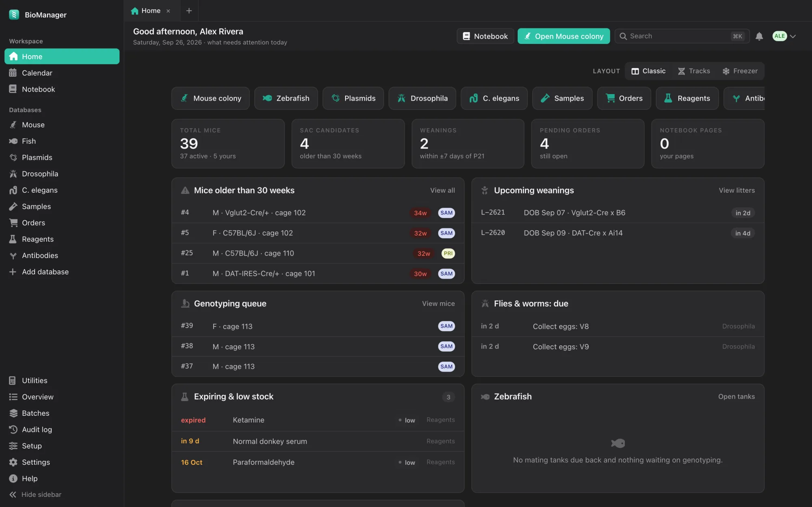</td>
  </tr>
</table>

---

## 🚀 Ways to run it

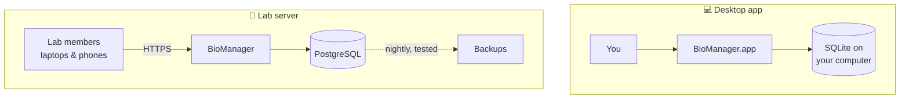

| | 💻 Desktop app | 🏫 Lab server | 🛠️ From source |
| --- | --- | --- | --- |
| **For** | one person, one computer | a whole lab, from any browser | developers |
| **Database** | SQLite, on your computer | PostgreSQL | SQLite (or PostgreSQL) |
| **Setup** | download and open | Docker on a Linux machine or VM | Python 3.11+ and Node |
| **Backups** | `dbtool.py backup` | automatic, nightly, test-restored weekly, optional off-site copy | `dbtool.py backup` |
| **Phones & QR codes** | — only your computer can reach it | ✅ | on your local network |

> [!NOTE]
> Start on the desktop and move to a server later —
> `scripts/migrate-to-postgres.py` carries an existing database across.

---

## 🏁 Getting started

### 💻 Desktop app

1. Download BioManager for your system from the
   [**BioManager website**](https://gaspolymerase.github.io/biomanager-app/#download),
   or build it yourself (below).
2. **macOS:** open the download and drag BioManager into Applications.
   The first time, **right-click the app and choose Open** — macOS asks
   once because the app is not signed through the App Store.
3. Create your account. The first account on a computer is the admin.

Your data lives outside the app, so updating or reinstalling never
touches it:

| System | Data folder |
| --- | --- |
| macOS | `~/Library/Application Support/Biomanager/` |
| Windows | `%APPDATA%\Biomanager\` |
| Linux | `~/.local/share/Biomanager/` |

<details>
<summary><b>Build the desktop app yourself</b></summary>

```bash
./scripts/build-desktop.sh
open dist/BioManager.app
```

This produces `dist/BioManager.app` on macOS, or `dist/BioManager/` on
Windows and Linux.
</details>

### 🏫 Lab server

The supported setup is the Docker stack in [`deploy/`](deploy/README.md):
HTTPS, PostgreSQL, and a backup service that dumps the database every
night, checks each dump and test-restores one every week.

```bash
git clone <this repository> biomanager && cd biomanager/deploy
cp .env.example .env && chmod 600 .env     # set DOMAIN, POSTGRES_PASSWORD, TZ
docker compose up -d --build
docker compose logs app | grep "setup code"
```

Open `https://<your domain>/register` and create the first account with
the **setup code** from the log. That account is the admin; signing in,
it answers four questions about what the lab keeps, and BioManager sets
itself up to match.

> [!IMPORTANT]
> Keep the server off the open internet: on the campus network, a VPN, or
> a private network such as Tailscale — `deploy/README.md` walks through
> it. [`deploy/RUNBOOK.md`](deploy/RUNBOOK.md) covers what to do when
> something goes wrong.

<details>
<summary><b>🛠️ Run from source</b></summary>

```bash
python3 -m venv .venv && source .venv/bin/activate
pip install -r requirements.txt
(cd frontend && npm install && npm run build:css)
PORT=5055 python run.py
```

Open <http://127.0.0.1:5055> (on macOS, AirPlay holds port 5000). The
first account needs the setup code printed in the terminal.

Want something to click around in? `python scripts/demo-data.py
/tmp/biomanager-demo` builds a made-up lab — the one in these
screenshots — and `BIOMANAGER_DATA_DIR=/tmp/biomanager-demo python run.py`
opens it.
</details>

---

## 📆 A first week with BioManager

A walk-through for a mouse colony. The other modules work the same way.

<table>
  <tr>
    <td valign="top" width="25%">
      <h4>Day 1 · Set up</h4>
      <ol>
        <li>Sign in as the admin; approve colleagues in <b>Settings → Manage users</b>.</li>
        <li><b>Mouse colony → Cages → Rack grid → New rack</b>, labelled like the stickers on your real racks.</li>
        <li>Add your lines under <b>Strains</b>.</li>
      </ol>
    </td>
    <td valign="top" width="25%">
      <h4>Day 2 · Bring the mice in</h4>
      <ol>
        <li><b>Mice → Add many</b>: describe a group, or upload your old spreadsheet as CSV.</li>
        <li>Check the preview; <b>Fill down</b>, <b>Skip</b>, then save.</li>
        <li>Give each cage a purpose and a rack position.</li>
      </ol>
    </td>
    <td valign="top" width="25%">
      <h4>Day 3 · Label the rack</h4>
      <ol>
        <li><b>Cages → Cage cards → Print.</b></li>
        <li>One card per cage.</li>
        <li>From now on, a phone camera opens any cage.</li>
      </ol>
    </td>
    <td valign="top" width="25%">
      <h4>Every day after</h4>
      <ol>
        <li>Open <b>Home</b>: weanings, genotyping, old breeders, low stock.</li>
        <li>Click an item to go straight to it.</li>
      </ol>
    </td>
  </tr>
</table>

<details>
<summary><b>🍼 When a litter is born</b></summary>

Open the breeding cage and choose **Litter born today**. The weaning and
genotyping dates appear on Home and the calendar when they come due. At
weaning, add the pups with **Add many** and move them to their new cages.
</details>

<details>
<summary><b>🧪 When an experiment starts</b></summary>

Tick the mice on **Mice** (shift-click selects a range). In the bar that
rises from the bottom, choose **Add to experiment** and name the treatment
group.
</details>

<details>
<summary><b>↩️ When you make a mistake</b></summary>

Open **Batches** in the sidebar and undo the bulk action. For a single
edit, the change history shows what the value used to be.
</details>

<details>
<summary><b>🦎 When you need a new kind of database</b></summary>

Choose **Add database**, pick a preset (Drosophila, C. elegans, zebrafish,
mouse) or start blank, name things your way and choose what it needs to
track.
</details>

<details>
<summary><b>⌨️ Keyboard shortcuts</b></summary>

| Keys | Does |
| --- | --- |
| <kbd>⌘/Ctrl</kbd> + <kbd>K</kbd> | Search everything |
| <kbd>⌘/Ctrl</kbd> + <kbd>B</kbd> | Show or hide the sidebar |
| <kbd>Alt</kbd> + <kbd>1</kbd>…<kbd>9</kbd> | Switch to tab 1 to 9 |
| <kbd>Alt</kbd> + <kbd>←</kbd> / <kbd>→</kbd> | Previous / next tab |
| <kbd>Alt</kbd> + <kbd>W</kbd> | Close the current tab |
| Middle-click a tab | Close it |
| <kbd>Shift</kbd>-click a row | Select a range |
</details>

---

## 👥 Accounts, permissions and privacy

- **The first account is the admin.** On a server it needs the setup code,
  so nobody else on the network can claim it first.
- **New sign-ups wait for an admin's approval.**
- **You edit what you own.** Your mice, cages and records are yours.
  **Breeder cages and anything marked shared belong to the whole lab.**
  Admins can change anything.
- **Everyone sees every lab database** — a census with holes is not a
  census. The **My colony / Shared / Everyone** switch filters the view
  without changing who may edit what.
- **The lab sees only what it uses.** On first sign-in the admin answers
  four questions: which databases the lab keeps and which functions it
  uses. Everyone then gets exactly those, in the sidebar and on their home
  page. **Lab setup** changes it any time, switches things off (hidden,
  never deleted) and makes someone else an admin.
- **Your own databases.** Anyone can add a database **just for them**, which
  only they and the admins see, and share it with the lab later. Admins add
  databases for the whole lab, and decide whether members may too.
- **Notifications.** The bell tells you when someone moves or gives you
  animals, records a genotype for yours, or when an order you placed is
  ordered, received or cancelled; you choose which kinds in Settings. New
  members get a short welcome tour.
- **When someone leaves,** the admin's **Overview** shows every cage by
  owner, idle cages and living mice without a cage, and **Racks & boxes**
  hands their racks to someone else.
- Passwords are at least 12 characters, repeated failed sign-ins are
  locked out, and changing a password signs out every other session.
- **Your data stays with you** — on your computer or your lab's server.
  Nothing is sent anywhere unless you connect Google Calendar, Google or
  Microsoft sign-in, or reminder emails.

## 💾 Your data and backups

> [!WARNING]
> **Don't keep the database in a cloud-synced folder** (OneDrive, Dropbox,
> Google Drive, iCloud Drive). Syncing corrupts SQLite files. BioManager
> warns you at startup if it spots this.

On a single computer:

```bash
python scripts/dbtool.py check                      # where is it, is it healthy, is it at risk
python scripts/dbtool.py backup                     # a consistent snapshot; keeps the last 30
python scripts/dbtool.py relocate ~/BioManagerData  # move it somewhere safe
python scripts/dbtool.py restore <file>
```

A lab server backs itself up every night, checks every backup and
test-restores one every week, with an optional off-site copy and a nightly
copy on the admin's Mac. **Settings → Export my data** downloads your own
records as a zip at any time.

---

## 📚 Documentation

| Document | For |
| --- | --- |
| [`deploy/README.md`](deploy/README.md) | Setting up a lab server: HTTPS, Tailscale, Google/Microsoft sign-in, backups, updates |
| [`deploy/RUNBOOK.md`](deploy/RUNBOOK.md) | Running a lab server: alerts, outages, restores, people joining and leaving |
| [`docs/GOOGLE_CALENDAR_SETUP.md`](docs/GOOGLE_CALENDAR_SETUP.md) | Connecting Google Calendar |
| [`docs/DEVELOPMENT.md`](docs/DEVELOPMENT.md) | How BioManager is built: stack, styling, icons, the organism engine, access control, audit and undo, tests, security settings |

Working on BioManager itself? Start with
[`docs/DEVELOPMENT.md`](docs/DEVELOPMENT.md). The test suite runs on SQLite
and PostgreSQL with `scripts/test.sh`, on every push. To refresh these
screenshots, see `scripts/screenshots.py`.

## 🙏 Licence and credits

BioManager is released under the [MIT licence](LICENSE).

Built with Python, Flask, SQLAlchemy, PostgreSQL / SQLite and Tailwind CSS.
Icons from [Font Awesome Free](https://fontawesome.com) (CC BY 4.0) and
[game-icons.net](https://game-icons.net) by Delapouite (CC BY 3.0) — the
mouse and fly are theirs; the plasmid, petri dish, cage, tank and
culture-vial icons were drawn for this project. The people and records in
the screenshots are made up.
